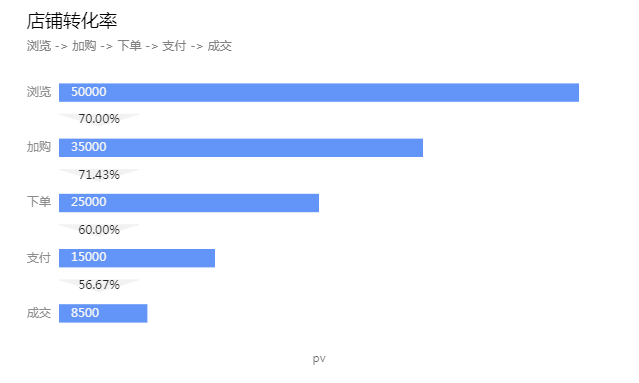

# 快速上手

#### 安装

see https://github.com/13kay/pyg2/releases/tag/0.1


#### 1 分钟上手

`pyg2` 的方法支持链式调用, 以具体图形类型函数函数 (如  `bar()` ) 开始, 以 `.render()` 结束:

```python
import pandas as pd
from pyg2 import bar

df = pd.DataFrame.from_records([
  { 'action': '浏览', 'pv': 50000 },
  { 'action': '加购', 'pv': 35000 },
  { 'action': '下单', 'pv': 25000 },
  { 'action': '支付', 'pv': 15000 },
  { 'action': '成交', 'pv': 8500 },
])
cfg = {
    'width':600,
    'conversionTag': {'visible': True}
}
bar(df, 'pv', 'action', cfg=cfg).title(title='店铺转化率', description='浏览 -> 加购 -> 下单 -> 支付 -> 成交').render()
```


